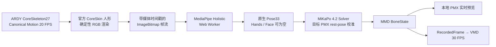

# Rayure ARDY Render Bridge → MediaPipe / MiKaPo → MMD 开发 Spec

状态：**R0 方案冻结；Phase 0/1/2 已实现，Phase 3 Workbench 开发中**
日期：2026-08-27
目标链路：`ARDY Joints Motion Series → Humanoid RGB Frames / Video → MediaPipe Holistic → MiKaPo → MMD Motion Series`
首要目标：**先用本地已有 MMD 模型打通并看见完整链路，再讨论产品化**

> 本文是规划文档，不是实施授权。R0 只允许形成方案；不得据此启动 ARDY、MediaPipe、MiKaPo、浏览器、Blender、真实模型测试、构建或外部发布。

## 0. 一页结论

### 0.1 选定方案

本轮锁定的第一优先 PoC 是一条**视觉协议桥**：



其核心边界是：

1. ARDY 只负责生成 `CoreSkeleton27` 动作；
2. ARDY 官方 CoreSkin 把 27 关节动作变成真正的人形画面；
3. MediaPipe 自己从画面产生原生 33 点人体观测；
4. MiKaPo 自己完成 MediaPipe → MMD 的几何解算、目标模型校准、滤波、grounding、足 IK 与 VMD 输出；
5. Rayure 不编写 `27 → 33` 人体拓扑转换，也不重启 ARDY rotation → MMD rest pose 的自研重定向。

### 0.2 “Video”的精确定义

链路名称中的 `Video` 表示**按时间排列的 RGB 人形帧**，不要求正式路径必须编码成 MP4：

- 最短完整链验证：生成本地 WebM/视频文件，直接上传原版 MiKaPo；
- 单页 Workbench：`canvas → ImageBitmap → MiKaPo pose-worker`，不编码、不写盘、不解码；
- 视频文件只保留为可复现的调试证据和故障分界点。

因此，正式 PoC 主路径是 `Motion → Rendered Frames → MediaPipe`；视频编码是可开关的旁路。

### 0.3 首版能力边界

首版只验证**主体骨骼动作**：root 高度、躯干、头颈、肩臂、腕、髋腿、膝、踝和足 IK。

- ARDY Core27 不提供完整十指和面部动作；首版不伪造这些数据；
- MediaPipe 未识别到手/脸时，MiKaPo 对应通道保持空或保持上一有效姿态；
- 头发、裙摆、袖子和饰品由 PMX 自身骨骼、刚体与物理系统产生二级运动；
- 全局水平 root 轨迹不是纯 MiKaPo visual path 的已证明能力，必须作为显式缺口处理，不能悄悄包装成“完整保真”。

### 0.4 实施形态

第一版单页演示不直接进入 Rayure Wallpaper 产品：

- 以锁定版本的 MiKaPo 为 PoC Workbench 基底；
- 增加一种 `ARDY Synthetic Frames` 输入模式；
- 同页展示 ARDY 人形源画面、MediaPipe 原始 landmark、目标 MMD 模型和诊断数据；
- 使用本地目录选择器读取用户已有 PMX 与相对纹理；
- 所有模型、纹理、动作、权重、视频、VMD 和截图保持本地、只读或 Git 忽略。

MiKaPo 为 GPL-3.0 项目。PoC 可以在隔离的本地 GPL 工作区验证，但**禁止把其 solver 源码直接复制进 Apache-2.0 的 Rayure 产品包并继续宣称整体仍是 Apache-2.0**。

## 1. 背景与当前基线

### 1.1 已有 Rayure 能力

当前 `main` 基线已经具备本方案所需的两端：

- `packages/protocol/src/canonical-motion.ts`：`rayure.motion.v1` / `ardy-core-27` 动作契约；
- `apps/wallpaper/src/ardy3d/core-skin-loader.ts`：从外部 CoreSkin 数据构造官方 ARDY 人形测试网格；
- `apps/wallpaper/src/ardy3d/canonical-rig-adapter.ts`：把 Canonical Motion 世界姿态驱动到 CoreSkin；
- `apps/wallpaper/src/ardy3d/three-js-debug-surface.ts`：可视化 CoreSkin 与 Canonical Motion；
- `apps/wallpaper/src/mmd-model-host.ts`：通过 `@yohawing/three-mmd-loader` 原生加载 PMX；
- Companion 已有 tokenized loopback 只读资源网关，Renderer 不接收磁盘路径；
- ARDY 真权重 → Canonical Motion 的 Windows 本地链此前已经独立验收。

本 PoC 应复用这些经过验证的契约和 CoreSkin 数学，不另造 ARDY 文件解析器或 PMX 解析器。

### 1.2 Gemini 演示分支的可继承证据

`feat/citlali-tavern-emage` 中可继承的是：

- 原生 PMX 可以用成熟 MMD loader 很直接地加载到网页；
- 网格、材质、骨架和 morph 可在一个直观页面中同时观察；
- 单页调试台比隐藏在产品主界面里的实验更容易定位问题。

不可继承为正式动作证据的是：

- 该页面的所谓 EMAGE 动作由关键词 profile、固定 Euler 值和正弦函数生成；
- T5 embedding 没有进入正式 EMAGE 动作网络；
- 页面“会动”不能证明 ARDY → MMD、EMAGE 或通用重定向已成功。

本 Spec 只借用其**直观演示方式**，不借用其伪动作生成逻辑和硬编码模型资产方式。

### 1.3 上游事实基线（2026-08-27 核验）

- ARDY 官方输出含 `posed_joints [T,J,3]`、local/global rotations、root positions、foot contacts、原生 FPS；Core checkpoint 为 20 FPS；
- ARDY 官方可视化入口能在浏览器中展示人形 mesh / skeleton；
- MediaPipe Pose Landmarker 输出 33 个 normalized/world landmarks，支持 IMAGE、VIDEO 和 LIVE_STREAM；
- MiKaPo 4.2.0 使用 `@mediapipe/tasks-vision 0.10.32` 的 HolisticLandmarker，并在 Web Worker 中传输 `ImageBitmap`；
- MiKaPo `SolverInput` 要求 Pose 33 点，双手各 21 点；手数据可以为空，主体仍可解算；
- MiKaPo 的 `RecordedFrame.time` 决定 VMD 帧号：`round((time-origin)×30)`；
- MiKaPo 的原生视频导出会按 VMD 30 FPS 对视频逐帧 seek、检测与解算；
- MiKaPo 为 GPL-3.0，Reze Engine 为 MIT，MediaPipe 示例代码为 Apache-2.0；模型 bundle 的再分发许可仍需在产品化前单独核实。

核验入口：[ARDY 官方 README](https://github.com/nv-tlabs/ardy/blob/main/README.md)、[MediaPipe Pose Landmarker 官方说明](https://developers.google.com/edge/mediapipe/solutions/vision/pose_landmarker/)、[MiKaPo 官方仓库](https://github.com/AmyangXYZ/MiKaPo)、[Reze Engine 官方仓库](https://github.com/AmyangXYZ/reze-engine)。实现前仍须锁定精确 commit，而不是跟随 `main` 漂移。

## 2. 方案裁决：选定、放弃与冻结

### 2.1 选定并进入 PoC

| ID | 方案 | 状态 | 理由 |
|---|---|---|---|
| S1 | ARDY Core27 → CoreSkin RGB → MediaPipe → MiKaPo → MMD | **选定** | 全链各困难部分都交给已有成熟实现，避免自研人体重定向 |
| S2 | 先用原版 MiKaPo 的视频上传完成 gold path | **选定** | 最快区分“视觉桥质量”与“集成代码问题” |
| S3 | 单页 Workbench 直接把 CoreSkin canvas 转成 ImageBitmap | **选定** | 调试直观，正式 PoC 无编解码和磁盘 I/O |
| S4 | ARDY 原生 20 FPS + 真实媒体时间戳 → VMD 30 FPS | **选定** | 保持动作时长，不改 ARDY、不重训 |
| S5 | PMX 原生加载、目标模型 rest-pose 由 MiKaPo 校准 | **选定** | 不先转 VRM，不自写目标骨架配置 |
| S6 | 主体动作先行，手指/面部为空 | **选定** | 忠于 ARDY 能力，不伪造不存在的细节 |
| S7 | 本地模型通过目录选择器或只读能力 URL 加载 | **选定** | 不复制私有模型，不硬编码机器路径 |
| S8 | MiKaPo 保持隔离的 GPL PoC 工作区 | **选定** | 先验证技术价值，同时保护 Rayure 许可边界 |

### 2.2 明确放弃，不得换名复活

| ID | 放弃方案 | 放弃原因 |
|---|---|---|
| D1 | ARDY 27 joints 直接重排/补点成 MediaPipe Pose33 | 27 个骨架关节与 33 个视觉 landmark 不同构；缺失眼、耳、鼻、heel 等语义，实质是自研人体转换算法 |
| D2 | ARDY rotation 直接换算成 MMD local rotation/rest pose | 已经证明会陷入坐标系、bind/rest pose、骨链粒度、IK 和 twist 问题；不是本轮目标 |
| D3 | 运行时 ARDY → BVH → Blender/HRS/RigBridge → MMD | 适合离线烘焙，不适合本轮最短可视链与实时 Workbench |
| D4 | 先把 PMX 转成 VRM 才显示 | Gemini 分支和 Rayure 当前 loader 均证明 PMX 可原生网页渲染 |
| D5 | ARDY 与完整 EMAGE 动作并行混合 | 两个完整身体生成器会争夺头、脊柱、肩臂等同一骨骼；Gemini 页面也没有真正运行 EMAGE |
| D6 | 强制 ARDY 变成 30 FPS、重训或改动作生成算法 | VMD 时间轴可由媒体时间戳转换，不需要改变动作源 |
| D7 | 把 MP4 编码、写盘、解码设为正式必经步骤 | 增加延迟和故障面；只保留为 gold path 和调试证据 |
| D8 | 把 MiKaPo solver 源码直接复制进 Rayure Apache 产品 | GPL-3.0 边界未解决，不能先集成后补许可证 |
| D9 | 让 MediaPipe或 ARDY 生成头发/裙摆动作 | 这些属于目标 PMX 自带物理骨骼和刚体系统 |

### 2.3 保留但冻结的离线路线

`feat/offline-rig-pipeline` 的 `ARDY → BVH → Blender/HRS/RigBridge → bake` 仍可作为未来的**离线高保真动作资产路线**，但它：

- 不参与本 PoC 的 runtime；
- 不作为 visual bridge 失败后的自动默认回退；
- 不因本 Spec 而被删除或否定历史证据；
- 只有用户另行授权时才继续其 Phase 2+。

## 3. PoC 目标与非目标

### 3.1 必须交付的能力

1. 载入一段已存在的 ARDY Canonical Motion；
2. 用官方 CoreSkin 在确定性相机下逐帧渲染人形；
3. 让 MediaPipe 对每帧产生原生 Pose33；
4. 让 MiKaPo 用本地目标 PMX 的 rest pose 解出 MMD BoneState；
5. 在同一页面同步播放 ARDY source、landmarks 与目标 PMX；
6. 导出可再次加载播放的 VMD；
7. 记录每阶段可观察证据和失败原因。

### 3.2 首轮明确不做

- 不直接接入 Wallpaper Engine 主产品入口；
- 不声明 Wallpaper Engine CEF/WebGPU 可用；
- 不做完整手指、脸、口型、眼神或表情生成；
- 不做 ARDY 与 EMAGE 的动作仲裁；
- 不解决任意非标准/匿名 MMD 骨架；
- 不写 Core27→Pose33 adapter；
- 不写通用 humanoid retargeter；
- 不把本地模型、CoreSkin、MediaPipe 模型或截图放入 Git/`public/`/`dist/`；
- 不发布、上传、Workshop 打包或声称资产可再分发。

## 4. 已知信息损失与风险

### 4.1 视觉往返必然有损

链路把精确 3D 骨架先降为像素，再从单目画面估计 3D：

```text
ARDY exact joint transforms
  → rendered pixels
  → estimated MediaPipe landmarks
  → solved MMD rotations
```

预期可能损失：前臂 roll/twist、深度方向幅度、自遮挡关节、细小腕部朝向和快速动作峰值。

这些属于 PoC 要测量的质量问题，不应在实现前用新算法“预修复”。

### 4.2 全局 root 水平轨迹

MediaPipe world landmarks 以髋部附近为中心；MiKaPo 当前 `センター` grounding 主要生成高度偏移，不能从纯 world landmarks 恢复 ARDY 的世界空间 X/Z 行走路线。

首轮因此允许：

- 行走、跑步等局部步态被还原；
- 目标模型可能原地走，而不是沿 ARDY 世界轨迹移动。

以下任何一个决定都必须单列 ADR，并得到用户后续授权：

1. 接受 MMD 动作只含局部姿态；
2. 增加一个仅传 root transform 的元数据旁路；
3. 对需要全局轨迹的动作改走离线 bake 路线。

不得在首轮偷偷引入 root 坐标映射并声称仍是纯 visual bridge。

### 4.3 CoreSkin 的视觉域差异

官方 CoreSkin 是无纹理测试人形，不等同于真实摄像画面。MediaPipe 可能因材质、轮廓、遮挡和朝向出现 domain gap。

允许调节的范围仅限三个渲染 profile：

1. 正面、自然肤色/中性材质、纯色高对比背景；
2. 正面偏转约 20° 的三分之四视角；
3. 同相机下的更清晰定向光与轮廓对比。

三个 profile 都不能稳定识别时，必须停下评估路线，不得转而自研 27→33 映射。

### 4.4 MiKaPo 已知能力边界

- 双脚同时离地与普通站立在 hip-centred landmarks 中可能不可区分；
- floor work / lying pose 的绝对高度不可由单目 world landmarks可靠恢复；
- 手部或面部不完整时应保持空/上一有效值，而不是构造假 landmarks；
- MMD 标准骨名或 rest-pose 结构不足的目标模型可能无法完整校准；
- 物理系统会放大上游主体 jitter，必须同时看主体骨骼和二级物理。

### 4.5 运行环境与许可

- MiKaPo 当前目标渲染器使用 WebGPU；普通 Chromium 通过不代表 Wallpaper Engine CEF 通过；
- MiKaPo 是 GPL-3.0，技术 PoC 通过不代表可以直接并入 Rayure 发布包；
- MediaPipe WASM、`.task` 模型与上游代码必须锁版本并审计再分发边界；
- 本地 MMD 模型只获得“用户自备、开发测试”资格，不自动获得截图公开或再分发资格。

## 5. 组件架构

### 5.1 `ArdyMotionSource`

输入：

- `rayure.motion.v1`；
- `jointSet = ardy-core-27`；
- 原生 20 FPS 或每帧严格递增的 `timeMs`；
- 初期只载入已存在的本地 fixture；实时 ARDY inference 后接。

职责：

- 校验 schema、27 关节、有限数值和四元数；
- 提供 `seek(frameIndex)` / `step()` / `reset()`；
- 不把 Canonical Motion 转成 MediaPipe landmarks。

### 5.2 `CoreSkinInferenceRenderer`

复用：

- `buildCoreSkinModel()`；
- `CanonicalMotionRigAdapter`；
- ARDY 官方 CoreSkin bind transforms 和 LBS 结果。

与当前可交互 debug surface 的差异：

- 使用独立、固定尺寸的 inference canvas；
- inference buffer 不包含网格、坐标轴、UI、文字或诊断 overlay；
- 相机只跟随 root 位置保持全身入画，不跟随 root 朝向旋转；
- 关闭动态像素比，锁定 512×512 起步；
- 每帧显式由 motion 时间驱动，不依赖墙钟或 `requestAnimationFrame` 抖动；
- 输出 `ImageBitmap`，可选旁路录制 WebM。

### 5.3 `SyntheticFrameSource`

建议的内部消息契约：

```ts
interface SyntheticFramePacket {
  schema: 'rayure.synthetic-human-frame.v1'
  runId: string
  frameIndex: number
  mediaTimeMs: number
  sourceFps: number
  width: 512
  height: 512
  bitmap: ImageBitmap
}
```

硬约束：

- `frameIndex` 从 0 连续递增；
- `mediaTimeMs = sourceFrame.timeMs`，不得用 worker 返回时间代替；
- 同一时刻最多一帧在 MediaPipe worker 中；
- worker 未返回时禁止无限排队；离线转换应等待结果再进下一帧；
- 取消或 reset 后，旧 `runId` 结果必须丢弃并关闭 bitmap。

### 5.4 `MediaPipeStage`

PoC 直接复用 MiKaPo 的 Holistic worker 设计：

- `HolisticLandmarker`；
- `runningMode = VIDEO`；
- transferred `ImageBitmap`；
- `poseWorldLandmarks`、双手 world landmarks 和 face landmarks；
- GPU delegate 失败时允许 CPU fallback，但必须显示真实状态；
- WASM 和模型从本机锁定来源加载，正式离线包不得依赖 CDN。

首版处理：

- Pose33 为必需通道；
- Hands/Face 可为空；
- 不用 ARDY joints 填补缺失的 MediaPipe 点；
- raw landmark overlay 画在独立诊断 canvas 上，不污染 inference buffer。

### 5.5 `MiKaPoStage`

保持上游职责不变：

1. 读取目标 PMX 的标准 MMD rest bone positions；
2. `Solver.calibrate(restWorldPos)`；
3. `Solver.solve(landmarks, mediaTimeMs)`；
4. 产生 `BoneState[]`；
5. 对目标 PMX 实时应用；
6. 保存 `{time,boneStates,morphWeights:null}`；
7. `buildClip()` / Reze Engine `exportVmd()`。

禁止：

- 改写 MiKaPo solver 数学以迎合 ARDY；
- 为 Core27 新增 synthetic Pose33；
- 在尚未取得 gold path 证据前调滤波常量或 IK 算法。

### 5.6 `MmdTargetStage`

PoC 目标模型从用户本地目录加载：

- 通过目录选择器获取 PMX 和相对纹理文件；或
- 通过现有 Companion tokenized loopback 能力 URL 只读访问；
- 页面状态只显示本地别名，不记录绝对路径；
- 不复制模型到 PoC 源码、`public/`、`dist/` 或截图发布目录。

首轮目标只要求一个已知能由原生 MMD loader 正确加载、且具备主体标准骨骼的本地 PMX。模型数量扩展不是完整链 PoC 的阻塞项。

### 5.7 `RunRecorder`

每次运行生成本地、Git 忽略的证据包：

```text
scratch/ardy-mikapo-poc/runs/<run-id>/
  run-summary.json
  source.webm                  # 可选
  pose-observations.json       # 可选，默认只留统计
  output.vmd
  console.txt
  screenshots/                # 仅本地验收
```

`run-summary.json` 只记录：依赖版本、匿名 fixture ID、帧数、时长、检测成功率、连续 dropout、导出摘要和错误码。不得写入本地资产绝对路径、模型作者私密信息或凭据。

## 6. 单页 Workbench 交互 Spec

### 6.1 布局

页面固定为三个主要观察区：

1. **ARDY Source**：CoreSkin 原始动作与当前 frame/time；
2. **MediaPipe Diagnostics**：实际送检画面、33 点 overlay、当前置信度与 dropout；
3. **MMD Target**：本地 PMX 的实时 MiKaPo 结果与物理开关状态。

底部是统一时间轴；右侧是短状态/错误面板。不得使用与真实结果无关的“GPU 850MB”“3.2ms”等硬编码假遥测。

### 6.2 控件

首版只提供：

- 选择 Canonical Motion；
- 选择本地 PMX 文件夹；
- 初始化 MediaPipe；
- Play / Pause；
- Previous Frame / Next Frame；
- Reset；
- Camera Profile 1/2/3；
- 显示/隐藏 raw landmarks；
- 记录 source video；
- 导出 VMD；
- 导出匿名诊断摘要。

不在首版加入表情面板、实时 prompt、EMAGE、角色对话、场景编辑或复杂滤波调参。

### 6.3 状态机

```text
EMPTY
  → MOTION_READY
  → SOURCE_RENDER_READY
  → MMD_MODEL_READY
  → MEDIAPIPE_READY
  → PROCESSING ↔ PAUSED
  → COMPLETED

任意初始化态 → FAILED
PROCESSING / PAUSED → CANCELLED → MOTION_READY
```

按钮必须由状态驱动：未加载 motion/PMX、MediaPipe 未 ready 或已有转换正在运行时，禁止启动第二条管线。

## 7. 时间轴与 20 → 30 FPS 规则

### 7.1 不改变 ARDY

ARDY Core motion 保持 20 FPS：

```text
0 ms, 50 ms, 100 ms, 150 ms, 200 ms, ...
```

每个成功解算的 `RecordedFrame.time` 使用 ARDY 原始媒体时间。MiKaPo VMD 帧号为：

```text
round((time - origin) × 30)
```

对应：

```text
0, 2, 3, 5, 6, ...
```

这会产生稀疏 30 FPS VMD keyframes，由 MMD 插值播放；动作时长不应变化。

### 7.2 gold video 路径

上传视频到原版 MiKaPo 时，MiKaPo 会按 1/30 秒 seek 视频。20 FPS 视频解码器可能在相邻 seek 点返回相同源帧，但：

- 视频媒体时长仍正确；
- MiKaPo 输出时间轴仍为 30 FPS；
- 该路径用于证明完整兼容，不作为最终性能结构。

### 7.3 允许后置评估，不允许前置复杂化

只有在完整链通过且肉眼确认存在明显 20→30 阶梯感后，才允许单列实验比较：

- 20 FPS 原始帧；
- 渲染前用通用 quaternion SLERP / position LERP 得到 30 FPS 人形帧。

此比较不得涉及骨架 retarget，也不得在 Phase 2 之前实施。

## 8. 分阶段实施计划

每个 Phase 最多修改三个逻辑节点；每个 Phase 结束必须停在可回滚提交或本地隔离快照，汇报证据后再继续。

### Phase 0 — 基线与边界锁定

逻辑节点：

1. 从当前 `main` 建立隔离实施分支，不切换/清理用户现有未跟踪资产；
2. 锁定 MiKaPo 4.2.0 的精确 commit、lockfile、MediaPipe 0.10.32、Reze Engine 版本及许可证；
3. 写明 PoC 工作区、私有资产、外部 CoreSkin/MediaPipe 模型和证据目录边界。

完成标准：

- 无真实模型、权重或第三方源码进入 Rayure tracked tree；
- 依赖来源和 checksum/commit 可复现；
- `LICENSE_GATE_OPEN` 被显式记录，而不是被“仅 PoC”掩盖。

回滚点：只删除/丢弃新的隔离分支和 task-owned `scratch/ardy-mikapo-poc/`；不得碰用户已有 `assets/`、`apps/citlali-tavern/` 或其他未跟踪内容。

### Phase 1 — 确定性 CoreSkin 帧源

逻辑节点：

1. 抽出可逐帧 seek 的 CoreSkin inference renderer；
2. 载入一段已存在的 Canonical Motion fixture，并按原始 `timeMs` 渲染；
3. 输出 frame inspector 与可选 WebM，不接 MediaPipe。

完成标准：

- 20 FPS frame count 与 Canonical Motion 一致；
- 第一帧、若干中间帧和末帧非空且全身入画；
- 相同输入两次运行得到相同 frame/time 序列；
- inference buffer 无网格、UI、文字和 overlay；
- 无 NaN、无 canvas/GPU 资源泄漏。

停止条件：三个受限 camera/material profile 仍不能稳定提供清晰全身画面时，不进入 Phase 2。

### Phase 2 — 最短完整 gold path

逻辑节点：

1. 把 Phase 1 的 source WebM 作为普通视频上传**未改 solver 的原版 MiKaPo**；
2. 通过目录选择器加载一个本地已有、已知可显示的 PMX；
3. 导出 VMD，并在 MiKaPo/Reze 中重新加载播放。

完成标准：

- MediaPipe 在源视频上产生 Pose33；
- MiKaPo 对目标 PMX 完成 rest-pose calibration；
- 目标模型主体随源动作变化；
- VMD 可导出、重新载入并播放；
- VMD 时长误差不超过 1 个 30 FPS 帧；
- 左右肢体无整体镜像，主要关节无持续反折；
- 结果被诚实标记为普通 Chromium + 本地资产 PoC。

这是第一个“完整链已打通”门。若失败，必须先判断失败位于 source render、MediaPipe、MiKaPo calibration、目标模型还是 VMD，而不是直接做单页集成。

### Phase 3 — 单页 ARDY / MiKaPo Workbench

逻辑节点：

1. 在隔离 GPL PoC 工作区为 MiKaPo 增加 `ARDY Synthetic Frames` 输入源，只替换视频帧来源；
2. 把 CoreSkin `ImageBitmap` 直接送进现有 `pose-worker`，保持 solver/VMD 数学不变；
3. 加入 Source / Landmarks / MMD 三面板、统一时间轴和真实诊断。

完成标准：

- 同一页面可 load motion、load PMX、运行、暂停、逐帧、reset 和导出；
- gold video 路径与 direct ImageBitmap 路径对相同源帧产生同方向、同时长的 MMD 动作；
- worker backpressure 不积压，cancel/reset 后无旧结果串入；
- 页面无硬编码私有路径、私有模型名称或假性能数字。

### Phase 4 — 动作质量矩阵

至少测试五类 3–8 秒动作：

| 类别 | 重点观察 | 首轮不要求 |
|---|---|---|
| 站立/重心变化 | 躯干稳定、脚不乱跳 | 微表情、手指 |
| 单/双臂挥手 | 左右、肩肘腕方向、roll | 精细手掌朝向 |
| 转身 | 上下半身朝向、头颈连续 | 世界 root 轨迹 |
| 下蹲/坐下 | root 高度、膝髋弯曲、grounding | 椅子接触约束 |
| 行走 | 局部步态、脚 IK、节奏 | 水平位移保留 |

硬门槛：

- 每条简单动作 Pose33 成功帧比例 ≥ 95%；
- 任一连续 pose dropout ≤ 5 个 ARDY 帧（250 ms）；
- 五类动作中至少四类能从目标 MMD 肉眼识别出原动作语义；
- 不出现与源动作无关的持续左右镜像、整肢反折或每帧 180° 翻转；
- 导出/重载后的时长、方向和 live preview 一致；
- 主体 jitter 与二级物理 jitter 分开记录。

门槛未通过时，记录失败动作、camera profile、dropout 区间和首个坏帧；不以“总体看起来还行”替代。

### Phase 5 — 实时 ARDY 接入（后置）

只在 Phase 4 通过后执行：

1. 把 fixture source 替换为现有 `motion.published` / continuation 流；
2. 用有界 buffer 连接 ARDY 20 FPS 产出与 MediaPipe worker 消费；
3. 验证 replan、cancel、late result discard 和目标 PMX 连续播放。

首版不要求每帧 wall-clock 实时。ARDY 生成、source render、MediaPipe detection 和目标渲染必须分别计时，不能只报总 FPS。

### Phase 6 — 产品化决策门

只有技术质量通过后，才选择其一：

1. MiKaPo 继续作为独立 GPL 本地组件，通过清晰进程/协议边界与 Rayure 协作；
2. 与上游取得兼容的授权或合作方式；
3. 用户明确接受相应 GPL 发布方式；
4. 若以上均不可行，再另立方案评估可替代 solver，而不是自动自研。

同时单独评估：

- Wallpaper Engine CEF 是否支持所需 Worker/WASM/GPU/WebGPU 能力；
- 若 WebGPU 不可用，是否只在产品端把已验证 BoneState 应用到 Rayure 现有 WebGL `MmdModelHost`；
- root X/Z 是否需要旁路；
- 本地模型与截图的公开许可。

## 9. 测试与故障矩阵

### 9.1 单元/契约测试

- SyntheticFramePacket 字段、边界和 monotonic time；
- 20 FPS 时间戳到 30 FPS VMD frame 的样例；
- runId 隔离、cancel、reset、late result discard；
- 单 in-flight frame backpressure；
- 空 Pose、空 Hands、空 Face；
- NaN/Infinity/无效 quaternion 拒绝；
- 私有绝对路径不进入诊断摘要。

### 9.2 组件测试

- Canonical Motion → CoreSkin 指定 frame；
- CoreSkin canvas → non-empty ImageBitmap；
- ImageBitmap → MediaPipe 33 landmarks；
- PMX rest pose → MiKaPo calibration；
- landmarks → BoneState；
- RecordedFrame → VMD → reload。

### 9.3 负向场景

| 场景 | 预期行为 |
|---|---|
| CoreSkin 数据缺失 | `CORE_SKIN_UNAVAILABLE`，不进入 MediaPipe |
| inference frame 空白/人物出框 | `SOURCE_RENDER_INVALID`，保存首个坏帧索引 |
| MediaPipe WASM/model 缺失 | `MEDIAPIPE_UNAVAILABLE`，不伪造结果 |
| worker GPU delegate 失败 | 显示 CPU fallback；CPU 也失败则停止 |
| Pose 不足 33 点 | `POSE_MISSING`，保持/跳过该时刻，不补点 |
| 本地 PMX 或纹理不完整 | `MMD_MODEL_LOAD_FAILED`，不复制修补资产 |
| 目标标准骨骼不足 | `MIKAPO_CALIBRATION_INCOMPLETE`，列出缺骨 |
| 转换中 reset | 旧 run 的 bitmap/result 全部释放和丢弃 |
| VMD 时长错误 | `VMD_DURATION_MISMATCH`，不声称链路通过 |
| WebGPU 不可用 | 普通 PoC 标记失败/降级；不外推 CEF 结论 |
| GPL/资产许可未关闭 | 技术 PoC 可保持本地，产品集成和发布停止 |

### 9.4 失败码

至少冻结以下可搜索错误码：

```text
SOURCE_MOTION_INVALID
CORE_SKIN_UNAVAILABLE
SOURCE_RENDER_INVALID
MEDIAPIPE_UNAVAILABLE
POSE_MISSING
POSE_DROPOUT_EXCEEDED
MIKAPO_CALIBRATION_INCOMPLETE
MMD_MODEL_LOAD_FAILED
VMD_EXPORT_FAILED
VMD_DURATION_MISMATCH
MMD_PLAYBACK_FAILED
WEBGPU_UNAVAILABLE
GLOBAL_ROOT_NOT_PRESERVED
PRIVATE_ASSET_BOUNDARY_VIOLATION
LICENSE_GATE_OPEN
```

## 10. 资产、隐私与许可边界

### 10.1 本地已有 MMD 模型

- 只作为用户自备的本地开发测试输入；
- 目录选择器或受限回环 URL 只读访问；
- 不复制到新的 demo `assets/`；
- 不进入 Git status 的新增 tracked 文件；
- 不进入 `public/`、`dist/`、安装包、Release、Workshop；
- 不默认发布包含该模型的截图、视频或 VMD；
- Spec 和日志使用匿名别名，不写具体绝对路径。

### 10.2 ARDY / MediaPipe 资源

- ARDY 权重、文本编码器、CoreSkin fixture 保持包外；
- MediaPipe WASM 和 `.task` 使用锁定的本地缓存；
- 是否能随产品再分发必须独立审计；
- 不把 Hugging Face token、缓存凭据或下载 URL token 写入代码/日志。

### 10.3 MiKaPo

- 技术验证基于锁定的上游 GPL-3.0 版本；
- 本地修改必须保留上游版权与许可；
- Rayure Apache 源码与 GPL PoC 工作区分开；
- 未完成产品化 ADR 前，不把 MiKaPo solver 打进 Rayure package 或 release。

## 11. 验收层级

每层必须单独报告：

| 层级 | 通过含义 | 本 Spec 当前状态 |
|---|---|---|
| A. 文档与契约 | 方案、接口、失败码、门槛清晰 | **R0 已审计（仅文档）** |
| B. Source renderer | Canonical Motion 可确定性渲染成人形帧 | **已验证（Edge + targeted）** |
| C. MediaPipe | synthetic humanoid 可稳定产生 Pose33 | **已验证（MiKaPo gold video + Edge）** |
| D. MiKaPo + 本地 PMX | BoneState 能驱动用户本地模型 | **已验证（外部 PMX + Edge）** |
| E. VMD roundtrip | VMD 可导出、重载、保持时长/方向 | **结构/时长已验证；同页可操作重载待 Phase 3** |
| F. 单页 Workbench | 三面板可操作、可逐帧诊断 | **未执行** |
| G. 实时 ARDY | 真 inference/continuation 持续驱动 | **未执行** |
| H. Wallpaper Engine CEF | 真实 CEF、控制台、长时间运行 | **未执行** |
| I. 许可与发布 | GPL、模型、MediaPipe 与发布包边界关闭 | **未执行** |

禁止用以下替代更高层验收：

- 单元测试通过 ≠ synthetic image 可被 MediaPipe 识别；
- 普通 Chromium 通过 ≠ Wallpaper Engine CEF 通过；
- 本地模型可加载 ≠ 可公开分发；
- PMX 在页面中会动 ≠ ARDY 动作语义已正确往返；
- VMD 文件生成 ≠ MMD/VMD roundtrip 正确；
- 一条动作通过 ≠ 该路线对常见动作可靠。

## 12. Definition of Done

### 12.1 第一优先完整链 PoC DoD

- [ ] 已存在 Canonical Motion 以原生时间轴驱动官方 CoreSkin；
- [ ] CoreSkin 视频可被原版 MiKaPo 识别；
- [ ] 一个本地已有 PMX 在 MiKaPo 中正确加载并校准；
- [ ] 目标 PMX 可辨认地复现主体动作；
- [ ] VMD 可导出并重新载入播放；
- [ ] 时长误差 ≤ 1/30 s；
- [ ] 没有私有资产、路径或截图进入 Git/`public/`/`dist/`；
- [ ] 失败位置和仍有缺口被分类报告。

### 12.2 单页 Workbench DoD

- [ ] Source / Landmarks / Target 同页同步；
- [ ] Play/Pause/Step/Reset/Cancel 状态一致；
- [ ] direct ImageBitmap 与 gold video 路径结果方向及时长一致；
- [ ] 没有 frame backlog、late result 串入或 GPU/bitmap 泄漏；
- [ ] 五类动作至少四类通过质量门；
- [ ] 真实指标取代全部假遥测；
- [ ] GPL PoC 与 Rayure 发布代码保持明确边界。

### 12.3 不包含在上述 DoD 中

- Wallpaper Engine CEF 验收；
- 全局 root X/Z 保真；
- 十指、表情、口型、眼神；
- 多种任意 MMD 骨架；
- 公共发布或商业分发；
- 离线 RigBridge/BVH 管线完成。

## 13. 实施代理的决策顺序

遇到歧义时严格按以下顺序：

1. 先保护用户资产、现有工作树和许可边界；
2. 先复现 stock MiKaPo gold path，再做集成；
3. 先定位 source / detection / solve / render / export 哪一段失败；
4. 优先调整确定性渲染输入，不改 solver 数学；
5. 三个渲染 profile 失败后停止，不自研 27→33；
6. 质量通过后才讨论实时、CEF、root side-channel 和产品许可；
7. 任何真实资产、构建、浏览器、外部程序或发布动作都必须符合用户当次明确授权。

## 14. 下一指令边界

R0 到此结束。下一步若用户批准实施，应从 **Phase 0 → Phase 1** 开始，并在 Phase 1 只交付确定性 CoreSkin 帧源；不得跳过 gold path 直接把 MiKaPo solver 复制进 Rayure，也不得重启已放弃的 ARDY→MMD rotation/rest-pose 路线。
