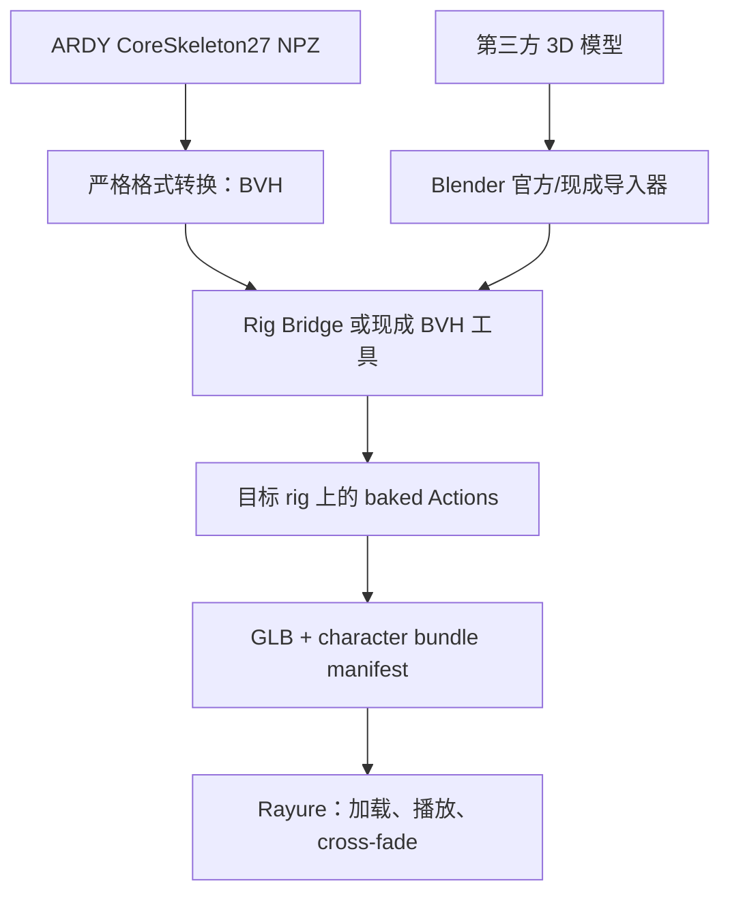

# Rayure 离线人形骨架标准化与烘焙动作管线开发 Spec

> 面向执行者：DeepSeek in Claude Code  
> 目标仓库：[ApolloEddy/Rayure](https://github.com/ApolloEddy/Rayure)  
> 基线分支：`main`  
> 基线提交：[`94db6e2592a31e6b9e85b22f750e993a297d204b`](https://github.com/ApolloEddy/Rayure/tree/94db6e2592a31e6b9e85b22f750e993a297d204b)  
> Spec 日期：2026-08-26  
> 规范词：**MUST / MUST NOT / SHOULD / MAY** 分别表示必须、禁止、应该、可选。

---

## 0. 给执行代理的首要指令

你要把 Rayure 的 3D 动作架构从“运行时识别骨架并适配动作”迁移为“Blender 离线识别、第三方工具重定向、烘焙后运行时纯播放”。

开始任何编辑前，必须：

1. `git status --short --branch`，确认并保护用户已有改动；不得覆盖、重置或整理与本任务无关的变更。
2. 确认当前 HEAD 与本 Spec 基线的差异，并重新阅读本 Spec 列出的现有实现文件。若仓库已变化，先把差异写入 Phase 0 报告，再继续。
3. 新建功能分支，例如 `feat/offline-rig-pipeline`。不要改写、amend、rebase 或 squash 用户已有提交。
4. 按本文阶段执行；**每个阶段验证通过后立即单独提交**。不得把多个阶段压成一个提交。
5. **PoC Gate 未通过时，禁止进入生产重构阶段，禁止大面积修改 `apps/`、`packages/`。**
6. 遇到 Rig Bridge、现成 BVH 工具或导入器无法处理的模型，生成结构化失败报告并停止；不得以新增 alias、手工猜骨、几何推断、骨轴推断或自研 retarget 补救。

本任务不是做一个能跑一次的最小脚本。PoC 通过后，要完成离线构建、协议、资产网关、3D 播放器、目录/调度接入、旧逻辑退役、测试、文档和验收证据这一整条生产链路。

---

## 1. GitHub 现状回顾

### 1.1 当前已具备的能力

基线 HEAD 已包含：

- ARDY 子进程、生成服务、运动调度、语义缓存与 Canonical Motion 发布链路。
- Live2D 原生模型、校准、语音、视觉和行为编排能力。
- PMX/VMD 的 Three.js/MMD 运行时，以及用于 3D 调试的 ARDY Canonical Motion 驱动表面。
- `scripts/ardy-bridge.py`：把 ARDY 结果输出为 `rayure.ardy-motion.v1`；随后 companion 将其转为 `rayure.motion.v1`。

这些能力应被视为迁移基线，而不是新架构已经完成的证据。

### 1.2 与目标架构冲突的现状

当前 3D 路径恰好包含本任务禁止继续发展的两类自研适配层：

1. [`apps/wallpaper/src/bone-remapper.ts`](https://github.com/ApolloEddy/Rayure/blob/94db6e2592a31e6b9e85b22f750e993a297d204b/apps/wallpaper/src/bone-remapper.ts) 内含 `STANDARD_BONE_ALIASES`，在 PMX 加载后按别名重命名/猜测骨骼；[`bone-remapper.test.ts`](https://github.com/ApolloEddy/Rayure/blob/94db6e2592a31e6b9e85b22f750e993a297d204b/apps/wallpaper/test/bone-remapper.test.ts) 固化了这套行为。
2. [`apps/wallpaper/src/ardy3d/canonical-rig-adapter.ts`](https://github.com/ApolloEddy/Rayure/blob/94db6e2592a31e6b9e85b22f750e993a297d204b/apps/wallpaper/src/ardy3d/canonical-rig-adapter.ts) 配合 [`core-bone-names.ts`](https://github.com/ApolloEddy/Rayure/blob/94db6e2592a31e6b9e85b22f750e993a297d204b/apps/wallpaper/src/ardy3d/core-bone-names.ts) 和 [`rig-scale.ts`](https://github.com/ApolloEddy/Rayure/blob/94db6e2592a31e6b9e85b22f750e993a297d204b/apps/wallpaper/src/ardy3d/rig-scale.ts)，在运行时按候选名称、层级和比例把 Canonical Motion 写入任意 Three.js 骨架。这本质上是运行时骨架识别/适配/重定向。

此外：

- [`ModelDescriptor`](https://github.com/ApolloEddy/Rayure/blob/94db6e2592a31e6b9e85b22f750e993a297d204b/packages/protocol/src/index.ts#L131) 目前只有 `pmx | live2d`。
- `MotionDescriptor` 目前只有 `vmd | live2d | canonical`。
- companion 资产网关尚未允许 `.glb/.gltf/.bin`。
- [`mmd-model-host.ts`](https://github.com/ApolloEddy/Rayure/blob/94db6e2592a31e6b9e85b22f750e993a297d204b/apps/wallpaper/src/mmd-model-host.ts) 会在生产 PMX 加载路径调用 BoneRemapper；[`motion-controller.ts`](https://github.com/ApolloEddy/Rayure/blob/94db6e2592a31e6b9e85b22f750e993a297d204b/apps/wallpaper/src/motion-controller.ts) 是 VMD 专用播放器。
- [`three-js-debug-surface.ts`](https://github.com/ApolloEddy/Rayure/blob/94db6e2592a31e6b9e85b22f750e993a297d204b/apps/wallpaper/src/ardy3d/three-js-debug-surface.ts) 是调试验证面，不是目标生产架构。
- 仓库还没有 Blender 离线构建工具、烘焙 GLB 契约、动作 bundle manifest 或基于 `AnimationMixer` 的纯播放 host。

### 1.3 必须保护的现有边界

- Rayure 仍然拥有 Wallpaper Engine CEF 内的 Renderer、Three.js Scene 和 frame loop。
- Live2D 仍可消费 Canonical Motion；本任务只禁止 **3D 运行时**再用 Canonical Motion 做骨架适配。
- ARDY 生成、语义缓存、语音、视觉和 Live2D 不应在 PoC 阶段被改动。
- 本地第三方模型、付费模型、私有纹理和 ARDY 权重不得提交进 Git。

---

## 2. 工具能力校正与架构决策

### ADR-001：Rig Bridge 不等于“换骨架拓扑工具”

[Rig Bridge / Humanoid Remap Studio](https://github.com/qw424886884/rig-bridge) 的公开能力是：识别人形 source/target rig、通过姿态和覆盖率门禁、重定向并把动作烘焙到目标 rig。它能处理常见乱命名、不同层级和 rest pose 差异，但**不会把任意目标模型重新建骨、重命名并转换成标准 VRM/Mixamo/UE5 内部骨架**。官方 Blender 扩展页见 [Humanoid Remap Studio](https://extensions.blender.org/add-ons/humanoid-remap-studio/)。

因此，“标准化”必须拆为两个可验证层次：

| 层次 | 本项目的定义 | 执行方式 |
|---|---|---|
| 运动源标准化 | 固定的 ARDY CoreSkeleton27 BVH 名称、层级、轴、单位、FPS 契约 | 纯格式转换器 |
| 运行资产标准化 | 固定的 `rayure.character-bundle.v1` manifest、GLB 格式、已烘焙 clip、播放语义 | Blender + Rig Bridge + glTF exporter |

默认且推荐的生产路径是 **Bake-in-place**：保留第三方模型原始内部 rig，由 Rig Bridge 把动作烘焙到它，再导出 GLB。Rayure 不需要知道其骨骼叫什么，因此也不需要把内部 rig 改成 Mixamo/VRM/UE5。

只有以下两种情况才可以宣称输出内部 rig 是 VRM/Mixamo/UE5：

1. 输入模型本来就是该标准且由对应现成工具验证通过；或
2. Phase 0 明确选定并验证了一个独立、现成、未修改的 rig conversion 工具来承担转换。

若产品要求“任意模型必须物理转换为 VRM/Mixamo/UE5 骨架”，但没有经验证的外部 converter，必须以 `TOOL_CAPABILITY_MISMATCH` 失败并停止。**不得把缺失能力偷偷补进 Rayure 或 Blender 脚本。**

### ADR-002：Rayure 只做播放器

目标 3D runtime 的允许职责只有：

- 从已有 tokenized loopback URL 加载 manifest 与 GLB；
- 验证协议、资源大小、hash/ID 和 clip 元数据；
- 使用 Three.js `GLTFLoader` 建立场景对象；
- 使用 `AnimationMixer` 按精确 clip 名称播放、停止、循环和 cross-fade；
- 管理事务隔离、旧请求取消、资源释放和错误 UI。

Three.js 按 glTF animation track 绑定已烘焙节点属于“播放”，不是 retarget。运行时不得遍历骨架做语义判断，也不得重写 track 名称。

### ADR-003：Blender 是离线/构建时依赖

Blender、Rig Bridge 和 BVH 工具不得进入 Wallpaper CEF，也不得在 `motion.play` 热路径启动。第三方模型与 ARDY 动作必须先离线构建成可发布 bundle。运行时遇到未烘焙 ARDY 动作时，只能命中已构建目录、回落到已烘焙 idle，或报告 `BAKED_CLIP_NOT_FOUND`；不得即时重定向。

---

## 3. 强制约束

### 3.1 绝对禁止

- 禁止自研或移植 retarget、IK、FK 重定向、约束求解、foot lock、root motion 修复算法。
- 禁止新增、扩展或维护 bone alias 表；禁止模糊匹配、正则猜骨、编辑距离猜骨、多语言名称映射。
- 禁止根据模型几何、骨长、左右位置、父子层级或朝向自行识别人形角色。
- 禁止推断骨轴、forward axis、roll、rest pose 或 target scale。
- 禁止修改、fork、monkey-patch Rig Bridge 或 BVH Retargeter 的算法和数据表。
- 禁止脚本静默写 Rig Bridge 的映射 slots 来绕过 `auto_guess` 失败。
- 禁止让 ARDY→BVH 转换器读取目标模型或 target skeleton。
- 禁止在 ARDY→BVH 中做平滑、去抖、补帧、重采样、动作修复、接地、去滑步或目标比例适配。
- 禁止继续给 `BoneRemapper`、`CanonicalMotionRigAdapter`、`CORE_BONE_CANDIDATES` 或 `rig-scale` 打补丁。
- 禁止 PoC 未通过就修改生产协议、生产 server、Wallpaper 主循环或删除旧实现。

### 3.2 允许的 ARDY→BVH 操作

仅允许：

- 读取 ARDY 官方 CoreSkeleton27 输出字段；优先直接读取官方 `.npz` 的 `local_rot_mats`、`root_positions`、`fps`。
- 使用固定、带版本号且可追溯到官方 ARDY 的 27 关节名称、父索引、rest offsets 和坐标系定义。
- 固定单位换算和固定坐标基变换。
- rotation matrix/quaternion 到固定 BVH Euler channel order 的等价表示转换；仅为保持同一旋转而做 ±360° 连续化是允许的。
- 把 root translation 写入 Hips channel，把 local rotations 写入对应关节 channel。
- 严格校验 shape、joint count、帧数、FPS、有限数值和输入版本。

若现有 `rayure.ardy-motion.v1` 只提供 world/global transform，PoC 不应反向扩展它。新 converter 应直接消费官方 ARDY `.npz`，现有 JSON bridge 保留给 Live2D。只有在官方输出不可取得 `local_rot_mats`，且 parent-world 到 local 的转换可证明是无损机械格式转换时，才允许提交一份 ADR 后采用；不得顺便加入姿态修复。

### 3.3 第三方工具使用约束

- Rig Bridge 固定使用官方发布版，并在 lock 文件记录版本、下载来源和校验和。
- 允许的自动路径是调用公开 operator，例如 `bpy.ops.hrs.auto_guess()`、读取 `hrs_can_execute_retarget` 与诊断字段、再调用 `bpy.ops.hrs.execute_retarget()`。
- 若使用 [BVH Motion Retargeter](https://github.com/BacteriaJun/BVH-Motion-Retargeter)，必须使用其内置的 Mixamo/UE5/VRM profile。ARDY BVH 的关节名应对齐它已有默认 profile；不得为本项目新增自定义 mapping JSON。
- 外部 addon API、版本或 operator 不匹配时必须失败；不得通过反射、内部模块 patch 或复制算法规避。
- 每次构建必须记录 Blender、Rig Bridge、BVH 工具、模型 importer、glTF exporter 和 ARDY 的版本。

---

## 4. 目标数据流



管线边界：

1. **Source motion boundary**：ARDY NPZ → 固定 CoreSkeleton27 BVH。无目标模型知识。
2. **DCC boundary**：Blender 导入目标模型；外部工具完成自动识别、rest-pose 处理、retarget 和 bake。
3. **Artifact boundary**：导出带 baked Actions 的 GLB 与 manifest。之后所有骨架语义结束。
4. **Runtime boundary**：Rayure 根据 clip ID/精确名称播放 glTF 动画，不接触 humanoid 语义。

---

## 5. 文件与目录规划

PoC 必须与生产代码隔离：

```text
tools/rig-pipeline/
  README.md
  toolchain.lock.json
  ardy_to_bvh.py
  schemas/
    core-skeleton-27.v1.json
    character-bundle.v1.schema.json
    pipeline-failure.v1.schema.json
  blender/
    rig_bridge_driver.py
    poc_retarget_and_bake.py
    build_character_bundle.py        # PoC 通过后才增加
  tests/
    test_ardy_to_bvh.py
    test_failure_schema.py
    fixtures/                         # 只放小型、可再分发、无私有资产 fixture
  reports/                            # 仅提交脱敏的 JSON/Markdown 证据

scratch/rig-pipeline-poc/             # gitignored；私有模型、blend、视频、GLB 中间物
```

PoC Gate 通过后再修改：

```text
packages/protocol/
apps/companion/
apps/wallpaper/
docs/
scripts/verify.ps1
```

`rig_bridge_driver.py` 只能负责：安装状态检查、设置 source/target object 引用、调用公开 operator、读取公开状态、导出诊断。文件中不得出现自建 alias、自动填 mapping slot 或姿态求解。

---

## 6. 契约定义

### 6.1 `core-skeleton-27.v1` BVH profile

profile 必须以 [ARDY 官方 skeleton definition](https://github.com/nv-tlabs/ardy/blob/main/ardy/skeleton/definitions.py) 为来源，固定以下内容：

- joint set：官方 CoreSkeleton27；名字保持 `Hips`、`Spine`、`Spine1`、`Spine2`、`Spine3`、`Neck`、`Head`、左右肩/臂/前臂/手/手端/拇指、左右大腿/小腿/脚/趾。
- hierarchy：与官方定义完全一致。
- rest offsets：来自固定版本 ARDY 官方中性骨架资源；不得从目标模型拟合。
- axis basis、单位倍率、Euler channel order：Phase 0 用官方 fixture 与 Blender round-trip 确认一次后写入 profile；以后不按模型或 clip 猜测。
- timing：保留输入 FPS 和帧数，不重采样。
- Hips：唯一 translation channel；其他 joint 只有 rotation channel。
- End Sites：按固定 profile 输出；不得从 target rig 补全。

转换器 CLI 建议：

```text
ardy_to_bvh.py \
  --input motion.npz \
  --output motion.bvh \
  --profile core-skeleton-27.v1 \
  --report motion.conversion.json
```

CLI 不得提供 `--target-model`、`--bone-map`、`--guess-axis`、`--scale-to-character`、`--fix-feet` 等参数。

输入校验失败时返回非零退出码，不产生“看似成功”的 BVH。输出应是确定性的：相同 input bytes、profile 和工具版本产生相同 BVH hash。

### 6.2 Blender/Rig Bridge 自动化契约

每次 target build 必须执行：

1. 新建干净 Blender scene。
2. 使用 Blender 官方 importer 或明确锁定的现成 importer 导入第三方模型；失败即 `IMPORT_FAILED`。
3. 导入 CoreSkeleton27 BVH 作为 source armature。
4. 明确设置 Rig Bridge source/target armature 引用。
5. 仅调用 Rig Bridge 自动识别；保存 `hrs_auto_summary`、`hrs_auto_detail`、posture/coverage 状态。
6. 若 `hrs_can_execute_retarget !== true`，输出失败报告并退出；不得进入手工 mapping 或 fallback。
7. 调用 Rig Bridge 的公开 retarget/bake operator。
8. 验证生成 Action 存在、frame range 正确、F-Curves 非空且数值有限，并保留 Rig Bridge 的结果 tag/metadata。
9. 将 Action 绑定到目标模型；保留模型材质、morph targets、secondary bones，但不得推断或驱动未被工具处理的面部/辅助骨。
10. 使用 Blender glTF exporter 输出 GLB。
11. 在另一个全新 Blender scene 中重新导入 GLB，不加载 Rig Bridge，确认 clip 可独立播放。

第 8、11 步是产物验证，不是 retarget 实现。

### 6.3 Character bundle manifest

生产 manifest 使用严格 schema，例如：

```json
{
  "schema": "rayure.character-bundle.v1",
  "bundleId": "albedo-core-v1",
  "characterId": "albedo",
  "displayName": "Albedo",
  "model": {
    "format": "glb",
    "file": "character.glb",
    "sha256": "<hex>",
    "bytes": 12345678
  },
  "rig": {
    "artifactProfile": "bake-in-place",
    "declaredStandard": null
  },
  "clips": [
    {
      "id": "idle-001",
      "displayName": "Idle 001",
      "embeddedClipName": "rayure__idle-001",
      "loop": true,
      "rootMotion": "in-place",
      "durationMs": 4200,
      "fps": 30,
      "sourceMotionSha256": "<hex>"
    }
  ],
  "build": {
    "pipelineVersion": "1.0.0",
    "blenderVersion": "<pinned>",
    "rigBridgeVersion": "<pinned>",
    "bvhTool": null,
    "ardyRevision": "<commit>",
    "sourceModelSha256": "<hex>",
    "builtAt": "<ISO-8601>"
  }
}
```

要求：

- `embeddedClipName` 在单一 GLB 内唯一，且只由离线 builder 生成。
- `rootMotion` 是离线构建选项；runtime 不做 root removal。
- `declaredStandard` 只有外部工具已验证为 `vrm`、`mixamo` 或 `ue5` 时才可填写；不能根据骨名猜。
- manifest 不包含本地绝对路径、用户名、密钥或第三方资产原始文件名。
- 模型 hash、动作 hash、工具链版本必须可复现。
- v1 PoC 使用单一 self-contained GLB。大目录是否改为 animation shard，必须先做 100–500 动作的大小、加载、内存和 track-binding PoC；不得一开始就把全部语义库重复打包。

### 6.4 Protocol 契约

PoC 通过后，协议增加明确 union，而不是给旧 `canonical` 偷塞字段：

```ts
interface BakedGlbModelDescriptor {
  id: string
  displayName: string
  format: 'baked-glb'
  url: string
  manifestUrl: string
}

interface BakedClipMotionDescriptor {
  id: string
  displayName: string
  format: 'baked-clip'
  url: string              // tokenized manifest URL；或按最终协议设计为 bundle reference
  characterId: string
  clipName: string         // 与 embeddedClipName 精确相同
  loop?: boolean
  fadeMs?: number
}
```

最终字段名可按现有协议风格调整，但必须满足：

- descriptor 只指向 tokenized loopback URL，不暴露文件系统路径。
- clip descriptor 与 character/bundle 明确绑定；不得把某角色动作静默用于另一个角色。
- 协议 validator 拒绝未知字段、空 ID、非法 URL、超长 clipName、非有限 duration/fade。
- 旧 `canonical` descriptor 仅供 Live2D；Wallpaper 3D host 不接受它。
- 旧 `pmx`/`vmd` 配置迁移后应返回 `MODEL_REQUIRES_OFFLINE_BUILD`，不得再默认进入 BoneRemapper。

### 6.5 Runtime 播放契约

新增 `BakedGlbModelHost`（最终命名可按仓库风格调整）：

- `GLTFLoader.loadAsync(model.url)`；不得加载 `.blend`、BVH 或源模型。
- 读取 `gltf.animations`，按 manifest 中的 **精确** `embeddedClipName` 建索引。
- `AnimationMixer.clipAction(clip)` 执行 play/stop/loop/cross-fade。
- 不得访问 `SkinnedMesh.skeleton.bones` 来决定关节语义。
- 不得修改 `KeyframeTrack.name`、查找近似节点名或建立 alias。
- 缺 clip 时报告 `BAKED_CLIP_NOT_FOUND`，保持或回落到已声明的 baked idle；不得选择“最像”的 clip。
- generation/request id 必须隔离，晚到的旧 load 不得覆盖新模型。
- 模型切换、clip 切换和 host dispose 必须释放 mixer action、geometry、material、texture 和 object URL/loader 资源。
- cross-fade 只混合已烘焙 clips，不更改骨架或 rest pose。

### 6.6 3D 动作目录与调度契约

- 3D 模式只发布已存在于当前 bundle manifest 的 `baked-clip`。
- 现有 ARDY 语义生成可继续服务 Live2D，或在离线 batch 中生成待烘焙动作；不得把新生成 Canonical Motion 直接送给 3D host。
- 建立 `motionId/promptHash -> baked clip id` 的离线目录。此目录只做资产索引，不做骨骼映射。
- 目录 miss 时发布可观测错误并使用 bundle 明确声明的 baked idle；不得启动 Blender 或 runtime retarget。
- 首轮不要处理全部大规模动作库。先用 100–500 个代表性动作测量 bundle 体积、构建时间、峰值内存、启动时延和检索命中，再决定分片方案。

### 6.7 失败报告契约

所有离线阶段共用 `rayure.rig-pipeline-failure.v1`：

```json
{
  "schema": "rayure.rig-pipeline-failure.v1",
  "runId": "<uuid>",
  "stage": "rig-detection",
  "code": "RIG_DETECTION_FAILED",
  "message": "Rig Bridge automatic mapping did not satisfy its execution gate.",
  "input": {
    "modelBasename": "character.pmx",
    "modelSha256": "<hex>",
    "motionSha256": "<hex>"
  },
  "toolchain": {
    "blenderVersion": "<version>",
    "rigBridgeVersion": "<version>",
    "bvhToolVersion": null
  },
  "externalToolStatus": {
    "autoSummary": "<verbatim short status>",
    "autoDetail": "<verbatim diagnostic>",
    "canExecuteRetarget": false
  },
  "fallbackAttempted": false,
  "createdAt": "<ISO-8601>"
}
```

允许的稳定错误码至少包括：

| 错误码 | 含义 |
|---|---|
| `INPUT_INVALID` | ARDY/manifest/模型输入缺字段、shape 错、非有限数值等 |
| `ARDY_REFERENCE_SKELETON_MISSING` | 固定官方 skeleton/profile 不可用 |
| `IMPORT_FAILED` | 现成模型/BVH importer 失败 |
| `RIG_BRIDGE_NOT_INSTALLED` | 官方 addon 未安装或未启用 |
| `RIG_BRIDGE_API_MISMATCH` | 锁定公开 API 与安装版本不符 |
| `RIG_DETECTION_FAILED` | auto guess/coverage gate 不通过 |
| `REST_POSE_REJECTED` | 外部工具姿态门禁拒绝 |
| `SOURCE_MAPPING_FAILED` | 现成 BVH profile 无法识别固定 source |
| `RETARGET_FAILED` | 外部 operator 执行失败 |
| `BAKE_VALIDATION_FAILED` | action/帧/曲线/重导入验证失败 |
| `EXPORT_FAILED` | GLB/manifest 导出失败 |
| `TOOL_CAPABILITY_MISMATCH` | 要求超出已验证外部工具能力 |
| `RUNTIME_LOAD_FAILED` | Rayure 无法加载已验证 bundle |
| `BAKED_CLIP_NOT_FOUND` | 目录或 GLB 中不存在精确 clip |

失败报告可以原样附带外部工具诊断，但不得自动生成 alias 建议或“可能是哪根骨”的猜测。

---

## 7. PoC 设计与硬门禁

### 7.1 PoC 输入矩阵

至少使用：

- 1 个干净的标准参考 rig：Mixamo、UE5 或有效 VRM 三者之一。
- 1 个真实的乱命名/不同层级/rest pose 第三方模型；优先使用当前本地验证过的 PMX 模型，但保持私有且 gitignored。
- 3 类 ARDY 动作：idle/轻微全身、明显上肢动作、带 Hips 位移的 locomotion。

参考 rig 证明 source/profile 没有基础错误；真实模型证明 Rig Bridge 是否确实覆盖产品输入。只在标准 rig 上成功不算 PoC 通过。

### 7.2 PoC 隔离

- PoC 输出到 `scratch/rig-pipeline-poc/`。
- 在 Phase 2 结束前，不修改 `apps/wallpaper/src/main.ts`、`RayureScene`、生产 protocol/server，也不删除旧文件。
- 可建立独立 Three.js harness 验证 GLB + `AnimationMixer`，但不得把 harness 接入生产入口。
- 私有模型、纹理、`.blend`、大体积 GLB、渲染视频不提交；提交脱敏报告、hash、截图索引和复现实验命令。

### 7.3 `POC-PASS` 全部条件

必须同时满足：

1. ARDY `.npz` → BVH 是确定性输出，严格输入校验通过。
2. Blender 重新导入 BVH 后，固定 reference rig 的根位移、帧数、FPS 和关节旋转与 ARDY source 在数值容差内一致；建议 rotation ≤ 0.25°、root translation ≤ 1 mm（换算到米后）。若官方单位/浮点精度证明需调整，必须先写证据再改阈值。
3. 两个目标模型均由 Rig Bridge **自动**通过执行门禁；没有手工 slot、alias 或代码 fallback。
4. 三类动作均成功 retarget、bake，并产生独立 Action。
5. GLB 在不加载任何 retarget addon 的全新 Blender scene 中可播放。
6. 独立 Three.js harness 仅通过 `GLTFLoader + AnimationMixer` 可精确选择三条 clip、loop、stop、cross-fade。
7. 对每个模型完成人工视觉验收：无爆炸骨架、无整体翻转、无明显漂移/穿地到不可用程度。视觉验收只判定工具输出是否可接受，不允许随后自写修复算法。
8. 生成 success report、toolchain lock、输入/output hash 和复现命令。

任一条件不满足即 `POC-FAIL`。失败时：

- 保存结构化失败报告和可公开的脱敏证据；
- 提交证据性 commit 后停止；
- 不进入 Phase 3；
- 向用户说明是哪个外部工具门禁失败，以及需要更换输入模型、工具版本或明确引入哪个现成 converter；
- 不提出“我可以补一个 alias/小算法”作为下一步。

---

## 8. 分阶段实施与提交协议

每个 Phase 的顺序固定为：检查工作区 → 实施 → 阶段测试 → 更新证据 → `git diff --check` → 单独提交 → 记录 commit SHA。下一 Phase 开始前工作区必须干净；用户原有未提交修改除外，此时必须避开并在报告中说明。

### Phase 0 — 基线、工具锁定与能力审计

范围仅限文档、`tools/rig-pipeline/toolchain.lock.json` 和脱敏报告。

任务：

- 重新核对本 Spec 第 1 节文件及当前调用图。
- 锁定 Blender、Rig Bridge、模型 importer、BVH Motion Retargeter（若使用）、glTF exporter、ARDY revision。
- 用官方文档/代码确认公开 operator 和状态字段。
- 验证当前产品所说“标准化骨架”选择 Bake-in-place，还是已经具备真正外部 converter。没有 converter 时不得承诺物理换骨架。
- 验证 ARDY 官方坐标系、单位、neutral skeleton 来源与 `.npz` shape；形成 `core-skeleton-27.v1` profile 草案。
- 建立禁改文件/禁用符号清单和 PoC 输入矩阵。

验收：能力表有证据、版本可安装、输入可合法使用、没有生产代码变更。

提交：

```text
docs(rig-pipeline): record baseline and tool capability gate
```

### Phase 1 — 隔离的 ARDY→BVH 格式转换 PoC

任务：

- 实现严格 converter、schema、golden fixture 与失败报告。
- converter 直接消费官方 ARDY `.npz`；不复用/扩大目标模型相关逻辑。
- 用 Blender 原生 BVH importer 做 round-trip 验证。
- 测试确定性 hash、非法 shape、缺 joint、NaN/Inf、错误 FPS、截断文件、超大输入限制。

验收：第 7.3 条第 1–2 项全部通过；代码中不存在 target/alias/guess/retarget 路径。

提交：

```text
feat(poc): add strict ARDY to BVH format bridge
```

### Phase 2 — Rig Bridge retarget/bake 与纯播放 PoC

任务：

- 实现最薄的 Blender driver；只调公开 API、读状态、输出报告。
- 跑完 2 个模型 × 3 个动作矩阵。
- 导出 self-contained GLB 与 manifest 草案。
- 建立独立 Three.js harness，验证精确 clip 播放/cross-fade。
- 进行人工视觉验收并保存脱敏证据。

验收：第 7.3 的八项条件全部通过，产出明确 `POC-PASS` 报告。

成功提交：

```text
test(poc): prove external retarget and baked GLB playback
```

失败提交（仅证据，不得夹带生产重构）：

```text
docs(poc): record external rig pipeline failure
```

失败后必须停止。

### Phase 3 — 生产级离线 bundle builder

仅在 `POC-PASS` 后开始。

任务：

- 把 PoC driver 提升为可批处理、可恢复、确定性的 CLI。
- 实现 strict manifest schema、hash、版本 provenance、日志、临时目录、原子输出和失败清理。
- 支持 in-place/root-motion 两种**外部工具已有**选项；不得自写 root motion 修改。
- 支持多 Action 命名、去重与构建缓存；cache key 至少包含 target model hash、source motion hash、profile 与完整 toolchain versions。
- 失败时保留报告，不发布半成品 bundle。
- 文档化私有资产输入、许可与 gitignore 规则。

验收：从空目录用单条 documented command 可重建同 hash bundle；中断不会留下被当成成功产物的目录。

提交：

```text
feat(rig-pipeline): build deterministic baked character bundles
```

### Phase 4 — Protocol、配置与资产网关

任务：

- 增加 `baked-glb` model 与 `baked-clip` motion 的 strict union/validator。
- 增加本地配置入口：用户选择 bundle manifest，而不是裸 PMX/FBX/VRM 源文件。
- server 在启动时校验 manifest、文件边界、hash、大小和 clip 唯一性。
- 资产网关仅增加运行时所需 `.glb`（必要时 `.gltf/.bin`）与 manifest；不得暴露 `.blend/.fbx/.pmx/.bvh` 离线源文件。
- 保持 token、origin、path traversal、大小限制与 16 KiB websocket 边界。
- 旧 PMX 配置返回清晰迁移错误或进入明确的 temporary legacy flag；legacy 路径不得调用 BoneRemapper。

验收：协议 round-trip/负例、网关安全、配置迁移测试通过；Live2D 测试无回归。

提交：

```text
feat(protocol): add baked GLB character bundle descriptors
```

### Phase 5 — Wallpaper 纯播放 host

任务：

- 新增 `BakedGlbModelHost`，复用当前 Renderer/Scene ownership、事务与 dispose 风格。
- 接入 `GLTFLoader`、`AnimationMixer`，实现 load、精确 clip lookup、play、stop、loop、cross-fade。
- 增加错误 UI/日志：bundle invalid、clip missing、load failed。
- 增加切换模型、快速连续 play、过期 async load、WebGL context lifecycle、资源释放测试。
- 用 guard test 证明 host 不导入旧 adapter，不读 bone names，不改 tracks。

验收：真实 PoC bundle 在 Wallpaper/浏览器 harness 可播放；无 Rig Bridge、BVH、ARDY 或骨架语义运行时依赖。

提交：

```text
feat(wallpaper): play baked GLB animation clips
```

### Phase 6 — 3D 动作目录、调度与模式分流

任务：

- 加载 bundle motion catalog，并把 3D motion offer/play 指向 `baked-clip`。
- 将 Live2D 的 Canonical Motion 路径与 3D baked 路径显式分流，避免格式偶然混用。
- 为目录 miss、character mismatch、clip unavailable 增加可观测错误和 baked idle fallback。
- 保留现有 scheduler 的并发/取消语义；3D 分支不发布大帧数据。
- 用 100–500 个代表动作做体积、内存、启动时延、构建耗时报告，再决定是否需要后续 animation shard ADR。

验收：Live2D 仍运行；3D 不再消费 `canonical`；网络/IPC 只传 descriptor，不传骨骼帧。

提交：

```text
feat(companion): route 3D playback through baked clip catalogs
```

### Phase 7 — 退役运行时骨架适配与 PMX/VMD 热路径

任务：

- 删除或彻底旁路 `bone-remapper.ts` 及其 alias 测试。
- 删除 3D 专用 `canonical-rig-adapter.ts`、`core-bone-names.ts`、`rig-scale.ts`、`three-js-debug-surface.ts` 及相关测试/调试入口。
- 若没有其他合法调用者，删除 `mmd-model-host.ts`、VMD 3D `motion-controller.ts` 和 `@yohawing/three-mmd-loader` runtime 依赖。
- `CanonicalMotion` 和 ARDY adapter 只保留给 Live2D/离线生成；以模块边界和测试固化。
- 更新 `scripts/verify.ps1`：禁止 runtime 重新出现 alias/remapper/retarget/骨轴猜测符号或从退役模块 import。
- 更新 architecture/migration docs，不再把 PMX runtime 当作 3D 基线。

建议 guard 不只搜索一个类名，还覆盖以下概念：

```text
STANDARD_BONE_ALIASES
CORE_BONE_CANDIDATES
remapModelBones
CanonicalMotionRigAdapter
resolveBone / guessBone / inferAxis（3D runtime 范围）
```

不要仅靠字符串 guard；还要有架构测试证明 `BakedGlbModelHost` 的依赖闭包不包含这些模块。

验收：生产 3D 路径只剩 GLB load + baked animation playback；Live2D 不回归；仓库内不存在仍可被默认进入的 remapper。

提交：

```text
refactor(3d): remove runtime bone remapping and retargeting
```

### Phase 8 — 全量验收、操作文档与交付证据

任务：

- 运行仓库现有完整 verify、test、typecheck、build、audit。
- 在目标 Wallpaper Engine CEF 环境做 model load、idle、动作切换、cross-fade、重复切换和长时运行 smoke test。
- 记录性能：启动时间、首 clip 时间、P50/P95 frame time、峰值内存、bundle bytes；与当前可比基线相比不得出现未解释的 >10% 回归。
- 完成用户文档：如何准备模型、运行离线 build、识别失败如何读取报告、如何在配置中选择 bundle、如何回滚。
- 完成开发文档：架构边界、schema、版本升级、工具锁更新流程。
- 汇总每阶段 commit SHA 与 PoC 证据。

验收：第 9 节 Definition of Done 全部满足。

提交：

```text
docs(rig-pipeline): finalize operations and acceptance evidence
```

---

## 9. Definition of Done

### 9.1 功能

- 第三方模型只在 Blender 离线阶段被识别与 retarget。
- Rig Bridge 自动门禁失败会稳定产出失败报告，且没有 fallback 算法。
- 至少两个目标模型、三类动作完成 PoC 矩阵。
- ARDY 动作通过固定 BVH profile 进入外部工具；转换器完全不知道 target rig。
- 产物是可独立播放的 GLB + strict manifest。
- Rayure 能加载、播放、停止、循环、cross-fade baked clips。
- 3D runtime 遇到 clip miss 不猜测、不 retarget，只报错/回落到 baked idle。

### 9.2 架构

- 3D runtime 中不存在 bone alias、humanoid recognition、axis inference、rest-pose solve 或 retarget。
- `BoneRemapper`、`CanonicalMotionRigAdapter` 已删除或不可达且不再被补丁维护。
- Live2D 与 baked 3D 的数据格式边界清晰。
- Blender/Rig Bridge 不属于 Wallpaper runtime dependency。
- “VRM/Mixamo/UE5”声明有外部工具验证；Bake-in-place 不伪称物理标准骨架。

### 9.3 测试与安全

- converter golden/round-trip/invalid-input/determinism tests 通过。
- manifest/protocol strict validation 与负例通过。
- 资产网关 traversal、token、extension、size 和 origin 测试通过。
- runtime lifecycle、并发、clip lookup、cross-fade、dispose 测试通过。
- Live2D、语音、视觉、companion 现有测试无回归。
- 完整 `scripts/verify.ps1`（或仓库当前等价入口）通过。
- 私有模型、权重、纹理、`.blend` 和大产物不在 Git history/staged files 中。

### 9.4 可运维与可复现

- 工具链版本与 hash 锁定。
- 每个 bundle 有 source/tool provenance 与 deterministic hash。
- 每个失败有 schema 化报告和非零退出码。
- 从干净环境可按 README 重建 sample bundle。
- 八个阶段均有独立 commit；若 PoC 失败，则只有 Phase 0、1 和失败证据 commit，生产代码未被大改。

---

## 10. 验收检查表

执行代理在最终答复中逐项给出 ✅ / ❌ / N/A 与证据路径：

- [ ] 当前 HEAD、工作区状态与基线差异已记录
- [ ] 工具版本/API/许可/校验和已锁定
- [ ] Rig Bridge 能力限制已被架构接受
- [ ] ARDY→BVH 只做格式转换
- [ ] converter 不接收 target model 或 mapping
- [ ] Rig Bridge auto gate 无手工 slot/fallback
- [ ] 真实乱命名模型 PoC 通过
- [ ] 全新 Blender scene 可播放导出 GLB
- [ ] Three.js harness 纯播放通过
- [ ] `POC-PASS` 后才开始生产改动
- [ ] bundle manifest/protocol strict validation 完成
- [ ] 资产网关只暴露运行产物
- [ ] 3D runtime 不读/猜 bone semantics
- [ ] BoneRemapper/CanonicalRigAdapter 已旁路或删除
- [ ] Live2D 无回归
- [ ] 完整 verify 通过
- [ ] 私有资产未提交
- [ ] 每阶段独立提交并列出 SHA

---

## 11. 执行中遇到歧义时的决策顺序

1. 先问：这一步是不是在识别骨骼、猜名称/轴/层级、修 rest pose 或把动作从一个 rig 映射到另一个 rig？
2. 若是，只能由已锁定外部工具完成。
3. 若外部工具没有公开、已验证的能力，返回失败；不能因为“代码不多”就自行实现。
4. 若只是序列化、固定坐标基/单位变换、hash、manifest、资产服务或精确 clip 播放，可在 Rayure/tooling 中实现。
5. 若不确定是格式转换还是 retarget，按 retarget 处理并停止，先写 ADR 让用户确认。

---

## 12. 最终交付答复模板

DeepSeek 完成或停止时，最终答复必须包含：

1. **结论**：`POC-PASS`、`POC-FAIL` 或完整生产迁移完成。
2. **外部工具结论**：Rig Bridge 对每个目标模型的自动识别/姿态/覆盖率结果。
3. **变更摘要**：按离线工具、协议/server、runtime、退役代码分组。
4. **验证证据**：实际运行的命令、测试结果、PoC report、bundle manifest、性能报告。
5. **约束审计**：明确说明没有自研 retarget、alias、骨轴推断或 Rig Bridge 修改。
6. **提交表**：Phase、commit SHA、commit subject、验证结果。
7. **失败时**：精确错误码、外部工具诊断、已停止在哪个 gate、确认未触碰哪些生产区域。

不得用“基本完成”“应该能跑”代替证据，也不得在 PoC 失败后提交一半生产重构。

