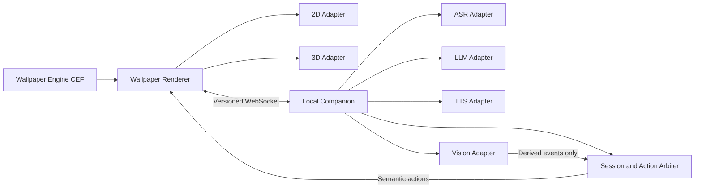

# Rayure 目标架构

状态：M1 PMX 角色基础已接受，后续里程碑按此边界扩展  
日期：2026-08-15

## 1. 架构决策

Rayure 选择 Wallpaper Engine 的 **Web wallpaper** 作为呈现宿主，而不是继续维护独立 WebView2/Electron 窗口并手动挂载 WorkerW。Wallpaper Engine 官方确认 Web 壁纸由 HTML、CSS 和 JavaScript 构成，并提供用户配置、音频、FPS 等专用接口：[Web Wallpaper Reference Guide](https://docs.wallpaperengine.io/web/overview.html)。

与旧 AIRI 插件路线不同，Rayure 必须拥有自己的 Renderer、Three.js Scene 和帧循环。Wallpaper Engine 只提供 CEF 宿主，不提供 AIRI 的 VRM Stage、AnimationMixer、MediaPipe 或 Agent 生命周期。

## 2. 组件与所有权



### Wallpaper Renderer

负责：

- 2D/3D 模型、场景、灯光和相机；
- 帧循环、Wallpaper Engine FPS 限制与暂停；
- 表情、口型、动作混合和本地鼠标交互；
- 将 Companion 的语义动作映射为当前模型能力。

不负责：

- 保存供应商 API Key；
- 启动任意本地进程；
- 直接访问未授权目录；
- 长期持有摄像头和麦克风。

### Local Companion

负责：

- 仅监听 `127.0.0.1` 的本地通信；
- 会话、能力授权、超时、重连和动作仲裁；
- ASR、LLM、TTS 与视觉供应商适配；
- Windows 权限与本地资源访问；
- 将原始传感器数据收敛成最小派生事件。

### Shared Protocol

负责：

- 版本、消息类型、关联 ID 与载荷上限；
- 严格拒绝未知字段、未知类型和超长消息；
- Renderer 与 Companion 的能力协商；
- 后续所有特权消息的认证与显式能力声明。

M1 允许 `client.hello → server.welcome/server.error → model.available`。`model.available` 只包含模型标识、显示名、格式和一次性回环 URL；磁盘路径始终留在 Companion。当前模型通道通过高熵会话令牌、Origin、GET/HEAD、扩展名白名单、大小限制和 realpath 边界收敛为只读能力。摄像头、麦克风、执行和供应商凭据等更高权限消息进入协议前，仍必须完成持久配对设计和威胁测试。

## 3. Wallpaper Engine 宿主约束

- 所有框架、脚本、字体和默认视觉资源随壁纸构建产物本地打包。官方同样建议不要依赖远程资源：[Creating a Web Wallpaper](https://docs.wallpaperengine.io/en/web/first/gettingstarted.html)。
- `window.wallpaperPropertyListener` 必须尽早设置，并分别处理用户属性、通用 FPS 与暂停状态：[Property Listener](https://docs.wallpaperengine.io/en/web/api/propertylistener.html)。
- 渲染循环遵守用户设置的 FPS，而不是锁死刷新率：[FPS Limiter](https://docs.wallpaperengine.io/en/web/performance/fps.html)。
- CEF 与普通 Chrome 并非完全等价；浏览器测试只算技术预检，最终必须通过 Wallpaper Engine 的 CEF 调试入口复核：[Web Wallpaper Debugging](https://docs.wallpaperengine.io/en/web/debug/debug.html)。
- Wallpaper Engine 导入时会复制所选目录的全部内容，故 `dist/` 必须是独立、最小、无私有资产的发布目录。

## 4. 数据流

### M0 生命周期

```text
Wallpaper load
  → ws://127.0.0.1:32145/ws
  → client.hello (protocolVersion, id, build)
  → Companion validates size, JSON shape and state
  → server.welcome (replyTo, connectionId, capabilities)
  → Wallpaper marks Companion connected
```

### M1 外置模型链路

```text
Companion reads ignored rayure.local.json
  → resolves and validates one authorized PMX
  → creates a random per-process asset token
  → model.available carries only http://127.0.0.1:<port>/assets/<token>/<entry>
  → Renderer loads PMX and relative textures
  → complete model is fitted and atomically committed
  → superseded/failed models are disposed without replacing the current model
```

### 目标语音链路

```text
显式启用麦克风
  → Companion ASR
  → 会话/Agent Adapter
  → 结构化回复（文本、情绪、动作意图）
  → TTS 音频与口型时间轴
  → Renderer 表情、口型、动作
  → execution receipt
```

### 目标视觉链路

```text
显式启用摄像头
  → 本地低频视觉推理
  → presence/head/gesture 等派生状态
  → 本地快速反射或高层事件
  → 原始帧及时释放
```

## 5. 失败与恢复原则

- Wallpaper 重载：Renderer 从空状态重新握手，不假定旧连接存在；
- Companion 未启动：壁纸继续渲染并指数退避重连；
- Companion 重启：旧 WebSocket 事件由 generation 隔离，不覆盖新连接；
- 协议不兼容：失败关闭，不尝试猜测字段；
- 模型或动作加载失败：保留当前有效角色/动作，不用半成品替换；
- 摄像头或麦克风失败：只降级对应能力，不中断壁纸渲染；
- Explorer/Wallpaper Engine 重载：不依赖内存中的唯一副本恢复用户配置。

## 6. 里程碑

1. **M0 独立基础**：离线壁纸壳、回环 Companion、严格握手协议；
2. **M1 PMX 角色基础**：官方项目清单、外置只读 PMX、事务加载、CEF 实机和属性热更新；
3. **M1.1 角色行为**：Idle、表情、鼠标注视、动作格式与完整资源释放；
4. **M2 语音闭环**：ASR → Agent → TTS → 口型/动作；
5. **M3 本地视觉**：presence/head/gesture 派生事件与权限控制；
6. **M4 2D 与资产系统**：2D Adapter、模型导入、授权与打包门禁；
7. **M5 产品化**：首次配对、设置界面、安装升级、长稳和多显示器验收。
